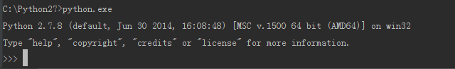
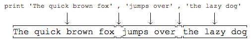

# 1 Python简介及入门

## 1.1 Python 简介
C语言是可以用来编写操作系统的贴近硬件的语言，所以，C语言适合开发那些追求运行速度、充分发挥硬件性能的程序。
而Python是用来编写应用程序的高级编程语言。

Python就为我们提供了非常完善的基础代码库，覆盖了网络、文件、GUI、数据库、文本等大量内容，被形象地称作“内置电池（batteries included）”。
用Python开发，许多功能不必从零编写，直接使用现成的即可。除了内置的库外，Python还有大量的第三方库，也就是别人开发的，供你直接使用的东西。
当然，如果你开发的代码通过很好的封装，也可以作为第三方库给别人使用。

Python适合开发哪些类型的应用呢？

1. 首选是网络应用，包括网站、后台服务等等；
2. 其次是许多日常需要的小工具，包括系统管理员需要的脚本任务等等；
3. 另外就是把其他语言开发的程序再包装起来，方便使用。

Python缺点：

1. 第一个缺点就是运行速度慢，和C程序相比非常慢，因为Python是解释型语言，你的代码在执行时会一行一行地翻译成CPU能理解的机器码，这个翻译过程非
常耗时，所以很慢。而C程序是运行前直接编译成CPU能执行的机器码，所以非常快。
2. 第二个缺点就是代码不能加密。如果要发布你的Python程序，实际上就是发布源代码，这一点跟C语言不同，C语言不用发布源代码，只需要把编译后的机器码（也就是你在Windows上常见的xxx.exe文件）发布出去。要从机器码反推出C代码是不可能的，所以
，凡是编译型的语言，都没有这个问题，而解释型的语言，则必须把源码发布出去。

## 1.2 Python安装
  
直接下载MSI 安装包

进入如下：


## 1.3 hello world

```
Type "help", "copyright", "credits" or "license" for more information.
>>> 100 + 200
300
>>> print 'Hello, world'
Hello, world
```

+ 输出：`print` + 字符串，输出字符串。
```
>>> print 'Hello, world'
Hello, world
```

`python` + 多个字符串 用`,`隔开，可以连接字符串。
```
>>> print 'the quick brown fox','jumps over','the lazy dog'
the quick brown fox jumps over the lazy dog
```
`print`会依次打印每个字符串，遇到逗号“,”会输出一个空格，因此，输出的字符串是这样拼起来的：


more:
```
>>> print 300
300
>>> print 100 + 200
300
>>> print '100 + 200 = ',100 + 200
100 + 200 =  300

```
对于`100 + 200`，Python解释器自动计算出结果300，但是，`'100 + 200 ='`是字符串而非数学公式，Python把它视为字符串，请自行解释上述打印结果。


+ 输入：raw_input()
```
>>> name = raw_input()
linc
>>> name
'linc'
>>> print 'hello,',name
hello, linc
```

执行：
```
D:\practise\git\python-learn\exs>python ex1.py
please enter your name:minc
hello ,  minc
```